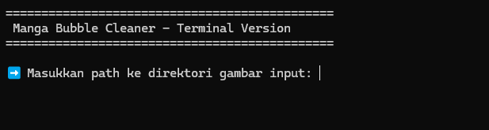
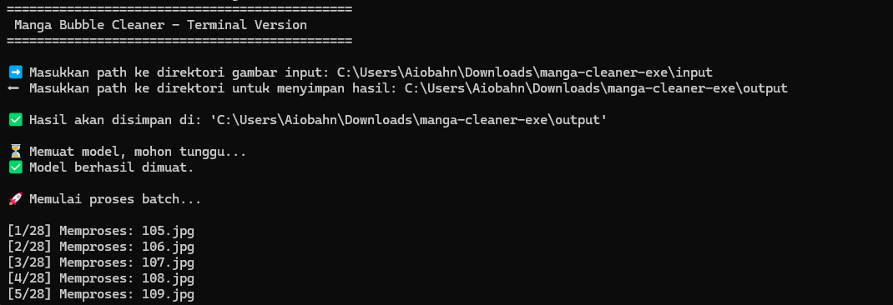

# Fast Bubble Cleaner

Bubble Cleaner untuk manga menggunakan model YOLOv11-segmented, untuk inferensi yang lebih cepat dan ringan, selagi mempertahankan akurasi deteksi yang tinggi. GPU tidak diperlukan (CPU saja cukup!).

Bubble Cleaner for manga using the YOLOv11-segmented model, optimized for faster and lighter inference while maintaining high detection accuracy. A GPU isn't needed (Just CPU is enough!).

## Usage

Untuk pemakaian, silakan download versi yang sudah di-Compile untuk CPU-only (Windows, .exe) di halaman [Release.](https://github.com/Faralha/Bubble-Cleaner/releases) Download file .zip dibawah asset, ekstrak, lalu jalankan exe. Tunggu hingga teks yang meminta memasukkan input path muncul.

For usage, please download the pre-compiled CPU-only version (Windows, .exe) from the [Release Page.](https://github.com/Faralha/Bubble-Cleaner/releases) Download the .zip file under the "Assets" section, extract it, and then run the .exe. Wait for the prompt asking for the input path to appear.



### Usage Example

1. Create input and output directory.

2. Run program.

3. Enter input and output directory, and the Manga Panel to be processed.

4. Wait until finished, done.




### Note

This model isn't fully optimized for bubble detection and refining, so use it with a grain of salt. Unaccuracy is expected, so use it just as a helper, not to remove Cleaner role entirely.


## Class Detection Features

- Ellipse / Bubble default
- Polygon
- Square / Narrative Dialogue
- Thorns / Shout (kurang dataset)


## Demo


## Training Model
Training dilakukan di Google Colab menggunakan gpu T4, dengan epoch 200 (berhenti di epoch 54 karena tidak ada peningkatan).

Confusion Matrix


Sebaran Label/Dataset


Hasil Akhir


| iterasi epoch | train/box_loss | train/seg_loss | metrics/precision(B) | metrics/recall(B) | metrics/mAP50(B) | metrics/mAP50(M) |
| :----: | :-----: | :-----: | :-----: | :-----: | :-----: | :-----: |
| 54 | 0.2383 | 0.28144 | 0.86595 | 0.80737 | 0.82864 | 0.82972 |

Untuk hasil iterasi epochs secara lengkap dapat melihat pada link ini: https://drive.google.com/file/d/1lJIBTGtpXOicD8E6ZnQcW2NUkYRSgfY4/view?usp=drive_link

## To-Do List
- Increase Dataset Variations
- Improve Post-processing, especially for joined bubble

## Run Locally

Clone the project

```bash
  git clone https://github.com/faralha/Bubble-Cleaner.git
```

Go to the project directory

```bash
  cd Bubble-Cleaner
```

Configure path
```
This file was imported from google collab, and all the training dataset and models were assumed stored in Drive. Change this accordingly.

For Training: Configure Dataset Path
For Inference: Configure Models Path
```

Run Notebook

- train.ipynb for Training Purposes, and
- inference.ipynb for Main Usage
